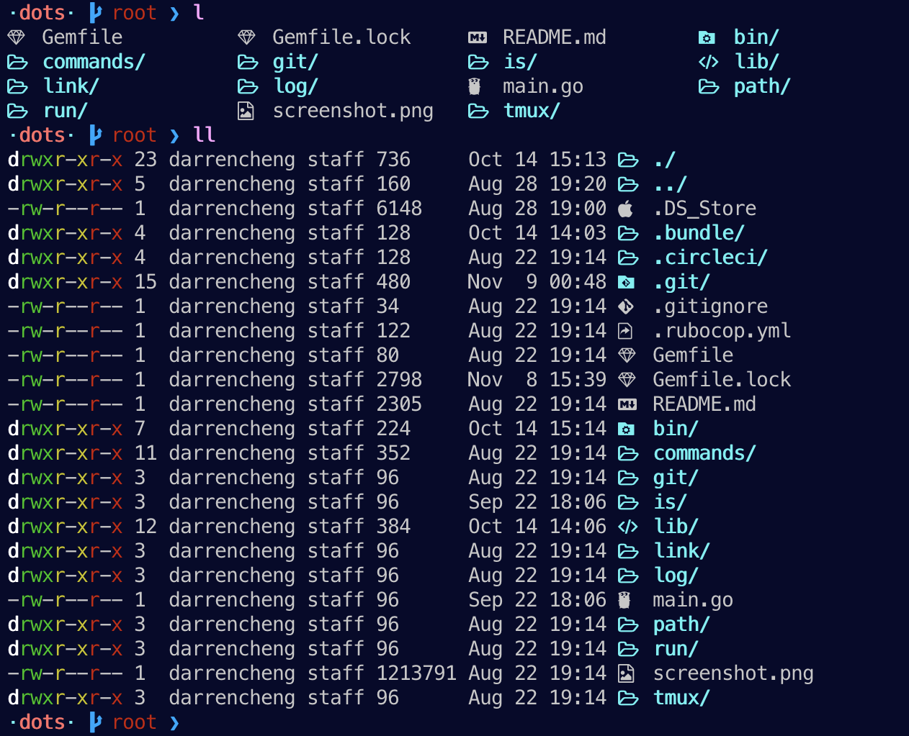

# Nerd LS

A golang LS implementation that provides color and icons to `ls`.

* * *



## In Development

This project is in active development and not yet fully featured. Feel free to
check it out as development progresses.

## Install

```
go get github.com/drn/nerd-ls
alias ls=nerd-ls
```

## Benchmarks

ls
```
❯ time (repeat 100 { ls })
( repeat 100; do; ls -G; done; )  0.13s user 0.22s system 90% cpu 0.386 total
```

[nerd-ls](https://github.com/drn/nerd-ls)
```
❯ time (repeat 100 { nerd-ls })
( repeat 100; do; nerd-ls; done; )  0.21s user 0.29s system 76% cpu 0.656 total
```

[colorls](https://github.com/athityakumar/colorls)

```
❯ time (repeat 100 { colorls })
( repeat 100; do; colorls; done; )  24.74s user 11.75s system 96% cpu 37.846 total
```

## Credit

The following projects have provided either inspiration, configuration, or
implementation guidance. Thank you!!

- [athityakumar/colorls](https://github.com/athityakumar/colorls)
- [reganm/ls](https://github.com/reganm/ls)
