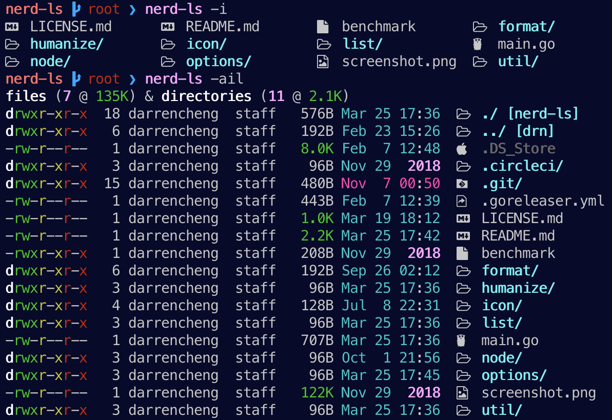

# Nerd LS

A golang LS implementation that provides color and icons to `ls`.

[](https://circleci.com/gh/drn/nerd-ls)

* * *

<p align="center"></p>

## Usage

Nerd LS is a drop-in replacement for the standard ls command.

```
Usage:
  nerd-ls [OPTIONS]

Application Options:
  -a, --all   Include directory entries whose names begin with a dot (.)
  -l, --long  List in long format
  -i, --icon  Display nerd-font icons

Help Options:
  -h, --help  Show this help message
```

## Install

```
go get github.com/drn/nerd-ls
alias ls=nerd-ls # optional
```

In order to have icons included with the -i/--icon flag, a patched
[Nerd Font](http://nerdfonts.com/)
is required.

Font Options:

* [Patched Font Directory](https://github.com/ryanoasis/nerd-fonts#patched-fonts)
* [Menlo Regular Nerd Font Complete](https://github.com/drn/dots/blob/master/lib/fonts/Menlo%20Regular%20Nerd%20Font%20Complete.otf)

## Benchmarks

<details>
<summary>click for details</summary>
<p>

ls
```
❯ time (repeat 100 { ls })
0.09s user 0.13s system 90% cpu 0.240 total
```

[nerd-ls](https://github.com/drn/nerd-ls)
```
❯ time (repeat 100 { nerd-ls })
0.23s user 0.23s system 77% cpu 0.599 total
```

[exa](https://github.com/ogham/exa)
```
❯ time (repeat 100 { exa })
0.57s user 0.38s system 91% cpu 1.035 total
```

[colorls](https://github.com/athityakumar/colorls)
```
❯ time (repeat 100 { colorls })
23.72s user 10.21s system 95% cpu 35.390 total
```

</p>
</details>

## Credit

The following projects have provided either inspiration, configuration, or
implementation guidance. Thank you!!

- [ryanoasis/nerd-fonts](https://github.com/ryanoasis/nerd-fonts)
- [athityakumar/colorls](https://github.com/athityakumar/colorls)
- [reganm/ls](https://github.com/reganm/ls)
- [illinoisjackson/even-better-ls](https://github.com/illinoisjackson/even-better-ls)
- [illinoisjackson/better-ls](https://github.com/illinoisjackson/better-ls)

## References

- [nerdfonts.com](http://nerdfonts.com/#cheat-sheet)

## License

This project is licensed under the [MIT License](LICENSE.md)
